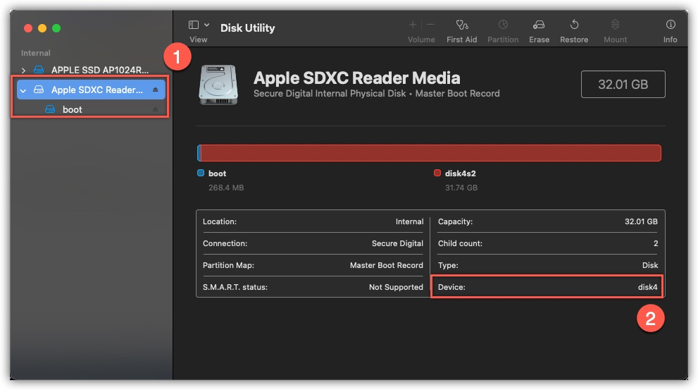

# RASPBERRYPI

<details>
  <summary id='table-of-contents'>
    <strong>Table of Contents</strong>
  </summary>

<!-- Begin Table of Contents GFM -->

- [Docs](#docs)
- [Commands](#commands)
  - [Upgrade](#upgrade)
  - [Reboot/Shutdown](#rebootshutdown)
  - [Install/Remove](#installremove)
- [SD Backup](#sd-backup)

<!-- End Table of Contents -->

</details>

## Docs

- [Static IP](/Static_IP)
- [Remote.it](/Remote.it)
- [Squid Server](/Squid_Server)
- [Open Media Vault](/OMV)

## Commands

### Upgrade

```Bash
   sudo apt-get update
   sudo apt-get upgrade
```

### Reboot/Shutdown

```Bash
   sudo reboot
   sudo shutdown -h now
```

### Install/Remove

```Bash
   sudo get-apt install
   sudo get-apt remove
```

## SD Backup



```bash
  sudo dd if=/dev/disk4 of=/Users/roger-that/Desktop/RaspberryPi.dmg

  # 62521344+0 records in
  # 62521344+0 records out
  # 32010928128 bytes transferred in 1046.526854 secs (30587775 bytes/sec)
```

> Since we are running the command using `sudo` we need to specify the full path (user path) to output the image
